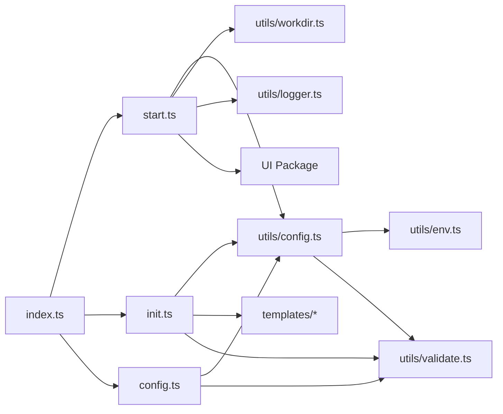
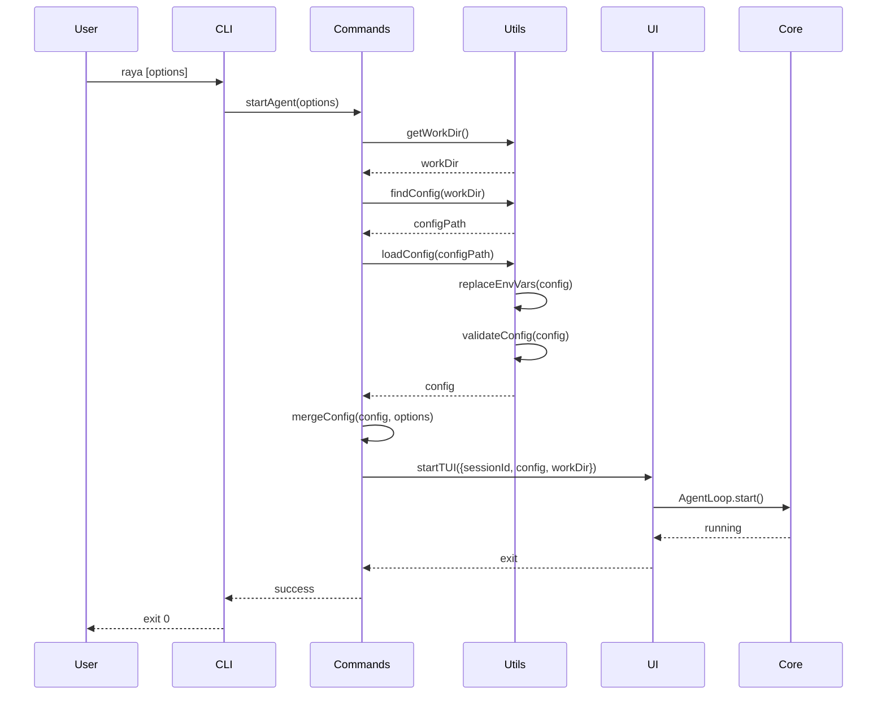
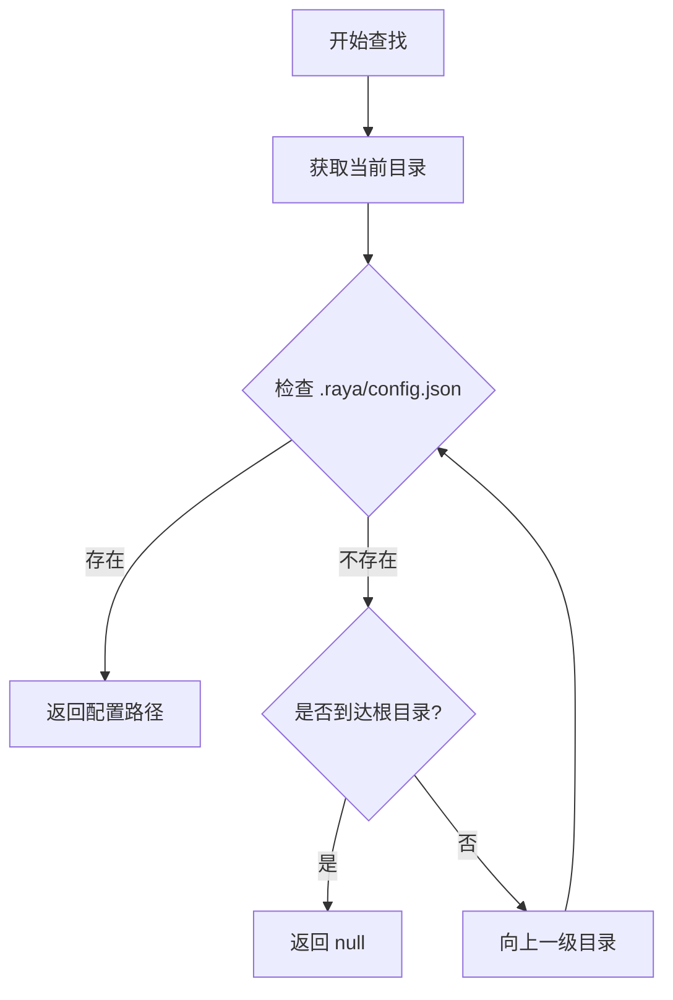
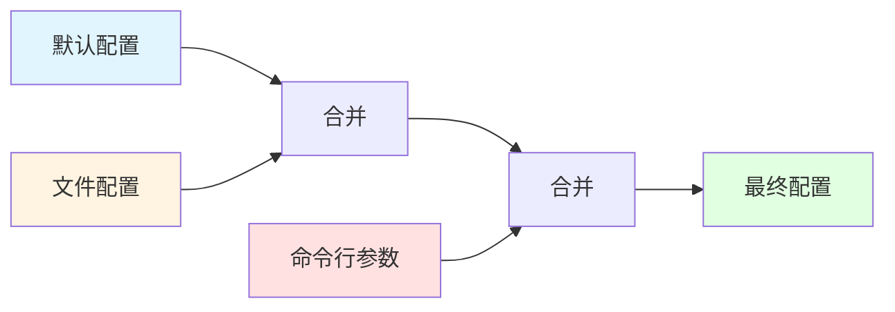
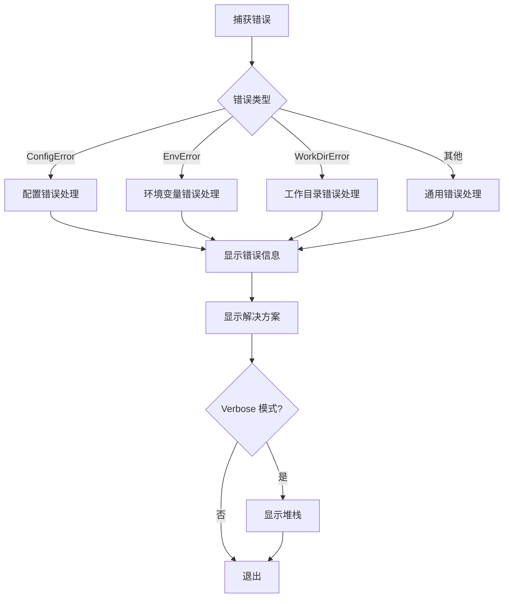

# Raya CLI 工具详细设计文档

## 概述

Raya CLI 是一个全局命令行工具，允许用户在任何目录通过 `raya` 命令启动 Raya AI Agent。该工具负责命令行参数解析、配置文件管理、环境变量处理，并与 UI 包和 Core 包集成，提供完整的 AI Agent 使用体验。

### 设计目标

1. **简单易用**：用户可以在任何目录执行 `raya` 命令即可启动 Agent
2. **灵活配置**：支持配置文件、环境变量和命令行参数的多层次配置
3. **安全可靠**：保护敏感信息，提供完善的错误处理
4. **跨平台兼容**：在 Windows、Linux 和 macOS 上都能正常工作
5. **可扩展性**：易于添加新命令、新模板和新功能

### 核心特性

- 全局命令入口，支持在任何目录启动
- 自动向上查找配置文件
- 环境变量替换和验证
- 交互式配置初始化
- 配置管理和验证
- 会话管理
- 跨平台兼容

## 架构设计

### 系统架构图

```mermaid
graph TB
    User[用户] --> CLI[CLI Package]
    CLI --> UI[UI Package]
    UI --> Core[Core Package]
    Core --> Common[Common Package]
    
    subgraph "CLI Package (packges/cli)"
        Entry[index.ts<br/>命令注册<br/>全局错误处理]
        Commands[commands/<br/>start.ts, init.ts, config.ts]
        Utils[utils/<br/>配置加载、环境变量、验证]
        Templates[templates/<br/>配置模板]
        Types[types/<br/>类型定义]
    end
    
    subgraph "UI Package (packges/ui)"
        TUI[startTUI()<br/>接受 agentConfig 和 workDir]
        AppComponent[App 组件<br/>TUI 界面渲染]
    end
    
    subgraph "Core Package (packges/core)"
        AgentLoop[AgentLoop<br/>Agent 核心逻辑]
        Tools[Tools<br/>工具调用]
    end
    
    subgraph "Common Package (packges/common)"
        SharedUtils[共享工具函数<br/>日志、格式化等]
    end
    
    Entry --> Commands
    Commands --> Utils
    Commands --> Templates
    Commands --> UI
    TUI --> AppComponent
    AppComponent --> AgentLoop
    AgentLoop --> Tools
    Utils --> Common
```

### 包职责划分

#### CLI Package (packges/cli)
**职责**：
- 命令行参数解析（Commander.js）
- 配置文件查找和加载（`.raya/config.json`）
- 环境变量替换和验证
- 交互式配置初始化（`raya init`）
- 配置管理命令（`raya config`）
- 调用 UI 包的 `startTUI()` 启动界面

**依赖**：
- `ui`: 导入 `startTUI()` 和 `AgentConfig` 类型
- `common`: 使用共享工具函数（可选）
- `commander`, `inquirer`, `chalk`, `ora`: CLI 工具库

**不负责**：
- ❌ TUI 界面渲染
- ❌ Agent 核心逻辑
- ❌ 工具调用

#### UI Package (packges/ui)
**职责**：
- 提供 `startTUI()` 函数，接受配置参数
- TUI 界面渲染（Ink + React）
- 用户交互处理
- 调用 Core 包的 AgentLoop

**依赖**：
- `core`: 使用 AgentLoop 和 AgentConfig 类型
- `ink`, `react`: TUI 框架

**接口**：
```typescript
export function startTUI(options?: {
  sessionId?: string;
  agentConfig?: AgentConfig;  // 从 CLI 传入
  workDir?: string;            // 工作目录
}): Promise<void>
```

#### Core Package (packges/core)
**职责**：
- Agent 核心逻辑（AgentLoop）
- 工具注册和调用
- 提供 AgentConfig 类型定义

**依赖**：
- `common`: 共享工具函数
- `ai`: AI SDK

#### Common Package (packges/common)
**职责**：
- 共享工具函数（日志、格式化等）
- 共享常量和配置

**依赖**：无
- `src/utils/config.ts`: 配置加载和查找
- `src/utils/workdir.ts`: 工作目录管理
- `src/utils/env.ts`: 环境变量处理
- `src/utils/logger.ts`: 日志工具
- `src/utils/validate.ts`: 配置验证

### 模块依赖关系



### 数据流设计

#### 启动流程



#### 配置查找流程



#### 配置合并流程




## 组件和接口

### 1. 入口模块（index.ts）

#### 职责
- 注册所有 CLI 命令
- 配置命令行参数解析
- 全局错误处理
- 版本信息管理

#### 接口定义

```typescript
#!/usr/bin/env bun
import { Command } from 'commander';

// 无导出接口，直接执行
// 注册命令并解析参数
```

#### 伪代码

```typescript
const program = new Command();

program
  .name('raya')
  .description('Raya AI Agent CLI')
  .version(getVersion());

// 注册 start 命令（默认）
program
  .command('start', { isDefault: true })
  .description('启动 Raya Agent')
  .option('-c, --config <path>', '配置文件路径')
  .option('-m, --model <model>', '模型名称')
  .option('-v, --verbose', '详细日志')
  .option('-s, --session <id>', '会话 ID')
  .action(startAgent);

// 注册 init 命令
program
  .command('init')
  .description('初始化配置文件')
  .option('-f, --force', '强制覆盖')
  .option('-t, --template <name>', '使用模板')
  .action(initConfig);

// 注册 config 命令
program
  .command('config')
  .description('管理配置')
  .option('-s, --show', '显示配置')
  .option('-e, --edit', '编辑配置')
  .option('-v, --validate', '验证配置')
  .option('-p, --path', '显示路径')
  .action(manageConfig);

// 全局错误处理
process.on('uncaughtException', handleError);
process.on('unhandledRejection', handleError);

program.parse();
```

### 2. 启动命令（commands/start.ts）

#### 职责
- 获取当前工作目录
- 加载和验证配置文件
- 处理命令行参数覆盖
- 启动 TUI 界面

#### 接口定义

```typescript
export interface StartOptions {
  config?: string;      // 配置文件路径
  model?: string;       // 模型名称
  verbose?: boolean;    // 详细日志
  session?: string;     // 会话 ID
}

export async function startAgent(options: StartOptions): Promise<void>;
```

#### 伪代码

```typescript
export async function startAgent(options: StartOptions) {
  const spinner = ora('正在启动 Raya Agent...').start();
  
  try {
    // 1. 获取工作目录
    const workDir = getWorkDir();
    validateWorkDir(workDir);
    
    // 2. 加载配置
    const config = await loadConfig(workDir, {
      configPath: options.config,
    });
    
    // 3. 命令行参数覆盖
    const finalConfig = mergeConfig(config, {
      model: options.model,
    });
    
    // 4. 生成或使用会话 ID
    const sessionId = options.session || generateSessionId();
    validateSessionId(sessionId);
    
    spinner.succeed('配置加载成功');
    
    // 5. 显示欢迎信息
    displayWelcome(workDir, finalConfig);
    
    // 6. 启动 TUI
    await startTUI({
      sessionId,
      agentConfig: finalConfig,
      workDir,
    });
    
  } catch (error) {
    spinner.fail('启动失败');
    handleError(error, options.verbose);
    process.exit(1);
  }
}
```

### 3. 初始化命令（commands/init.ts）

#### 职责
- 交互式配置创建
- 模板选择和应用
- 配置文件写入
- 创建 .gitignore 文件

#### 接口定义

```typescript
export interface InitOptions {
  force?: boolean;      // 强制覆盖
  template?: string;    // 模板名称
}

export async function initConfig(options: InitOptions): Promise<void>;
```

#### 伪代码

```typescript
export async function initConfig(options: InitOptions) {
  const workDir = process.cwd();
  const configDir = path.join(workDir, '.raya');
  const configPath = path.join(configDir, 'config.json');
  
  // 1. 检查是否已存在
  if (await exists(configPath) && !options.force) {
    const { overwrite } = await inquirer.prompt([{
      type: 'confirm',
      name: 'overwrite',
      message: '配置文件已存在，是否覆盖？',
      default: false,
    }]);
    
    if (!overwrite) return;
  }
  
  // 2. 选择模板
  let template = options.template;
  if (!template) {
    const { selectedTemplate } = await inquirer.prompt([{
      type: 'list',
      name: 'selectedTemplate',
      message: '选择 AI 提供商:',
      choices: ['openai', 'anthropic', 'azure', 'custom'],
    }]);
    template = selectedTemplate;
  }
  
  // 3. 获取模板配置
  const baseConfig = getTemplate(template);
  
  // 4. 交互式输入
  const answers = await inquirer.prompt([
    { type: 'input', name: 'name', message: 'Agent 名称:', default: baseConfig.name },
    { type: 'input', name: 'model', message: '模型:', default: baseConfig.model },
    // ... 更多问题
  ]);
  
  // 5. 构建配置
  const config = { ...baseConfig, ...answers };
  
  // 6. 验证配置
  const validation = validateConfig(config);
  if (!validation.valid) {
    console.error('配置无效:', validation.errors);
    process.exit(1);
  }
  
  // 7. 写入文件
  await fs.mkdir(configDir, { recursive: true });
  await fs.writeFile(configPath, JSON.stringify(config, null, 2));
  await fs.writeFile(
    path.join(configDir, '.gitignore'),
    'config.json\n*.log\n'
  );
  
  console.log(chalk.green('✅ 初始化完成！'));
  console.log(chalk.gray(`配置文件: ${configPath}`));
  console.log(chalk.gray(`现在可以运行: ${chalk.cyan('raya')}`));
}
```

### 4. 配置管理命令（commands/config.ts）

#### 职责
- 显示当前配置（隐藏敏感信息）
- 在编辑器中打开配置文件
- 验证配置格式
- 显示配置文件路径

#### 接口定义

```typescript
export interface ConfigOptions {
  show?: boolean;       // 显示配置
  edit?: boolean;       // 编辑配置
  validate?: boolean;   // 验证配置
  path?: boolean;       // 显示路径
}

export async function manageConfig(options: ConfigOptions): Promise<void>;
```

#### 伪代码

```typescript
export async function manageConfig(options: ConfigOptions) {
  const workDir = process.cwd();
  
  // 显示配置
  if (options.show) {
    const config = await loadConfig(workDir);
    const sanitized = sanitizeConfig(config);
    console.log(JSON.stringify(sanitized, null, 2));
  }
  
  // 编辑配置
  if (options.edit) {
    const configPath = await findConfig(workDir);
    if (!configPath) {
      console.error('配置文件未找到，请运行: raya init');
      process.exit(1);
    }
    
    const editor = process.env.EDITOR || getDefaultEditor();
    await exec(`${editor} ${configPath}`);
  }
  
  // 验证配置
  if (options.validate) {
    const config = await loadConfig(workDir);
    const result = validateConfig(config);
    
    if (result.valid) {
      console.log(chalk.green('✅ 配置有效'));
    } else {
      console.log(chalk.red('❌ 配置无效:'));
      result.errors.forEach(err => console.log(chalk.red(`  - ${err}`)));
      process.exit(1);
    }
  }
  
  // 显示路径
  if (options.path) {
    const configPath = await findConfig(workDir);
    if (configPath) {
      console.log(configPath);
    } else {
      console.log(chalk.yellow('配置文件未找到'));
      process.exit(1);
    }
  }
}
```


### 5. 配置加载工具（utils/config.ts）

#### 职责
- 向上递归查找配置文件
- 读取和解析 JSON 配置
- 环境变量替换
- 配置合并

#### 接口定义

```typescript
export interface LoadOptions {
  configPath?: string;  // 自定义配置路径
  validate?: boolean;   // 是否验证配置
}

export async function loadConfig(
  workDir: string,
  options?: LoadOptions
): Promise<AgentConfig>;

export async function findConfig(startDir: string): Promise<string | null>;

export function mergeConfig(
  base: Partial<AgentConfig>,
  override: Partial<AgentConfig>
): AgentConfig;
```

#### 伪代码

```typescript
export async function loadConfig(
  workDir: string,
  options: LoadOptions = {}
): Promise<AgentConfig> {
  // 1. 查找配置文件
  let configPath: string | null;
  
  if (options.configPath) {
    // 使用指定路径
    configPath = path.resolve(options.configPath);
  } else {
    // 向上查找
    configPath = await findConfig(workDir);
  }
  
  if (!configPath) {
    throw new ConfigError('CONFIG_NOT_FOUND', '配置文件未找到，请运行: raya init');
  }
  
  // 2. 读取文件
  const content = await fs.readFile(configPath, 'utf-8');
  
  // 3. 解析 JSON
  let config: any;
  try {
    config = JSON.parse(content);
  } catch (error) {
    throw new ConfigError('CONFIG_PARSE_ERROR', `配置文件解析失败: ${error.message}`);
  }
  
  // 4. 替换环境变量
  const replaced = replaceEnvVars(config);
  
  // 5. 验证配置
  if (options.validate !== false) {
    const validation = validateConfig(replaced);
    if (!validation.valid) {
      throw new ConfigError('CONFIG_INVALID', validation.errors.join(', '));
    }
  }
  
  return replaced as AgentConfig;
}

export async function findConfig(startDir: string): Promise<string | null> {
  let currentDir = path.resolve(startDir);
  
  while (true) {
    const configPath = path.join(currentDir, '.raya', 'config.json');
    
    try {
      await fs.access(configPath);
      return configPath;
    } catch {
      // 文件不存在，继续向上查找
    }
    
    const parentDir = path.dirname(currentDir);
    
    // 到达根目录
    if (parentDir === currentDir) {
      return null;
    }
    
    currentDir = parentDir;
  }
}

export function mergeConfig(
  base: Partial<AgentConfig>,
  override: Partial<AgentConfig>
): AgentConfig {
  // 深度合并
  return deepMerge(base, override);
}
```

### 6. 环境变量处理（utils/env.ts）

#### 职责
- 递归替换环境变量占位符
- 验证必需的环境变量
- 提供环境变量设置提示

#### 接口定义

```typescript
export function replaceEnvVars(obj: any): any;

export function validateEnvVars(config: AgentConfig): string[];

export function getEnvVarHints(provider: string): string[];
```

#### 伪代码

```typescript
export function replaceEnvVars(obj: any): any {
  // 字符串：替换占位符
  if (typeof obj === 'string') {
    return obj.replace(/\$\{([^}]+)\}/g, (match, varName) => {
      return process.env[varName] || '';
    });
  }
  
  // 数组：递归处理每个元素
  if (Array.isArray(obj)) {
    return obj.map(item => replaceEnvVars(item));
  }
  
  // 对象：递归处理每个属性
  if (obj && typeof obj === 'object') {
    const result: any = {};
    for (const [key, value] of Object.entries(obj)) {
      result[key] = replaceEnvVars(value);
    }
    return result;
  }
  
  // 其他类型：直接返回
  return obj;
}

export function validateEnvVars(config: AgentConfig): string[] {
  const missing: string[] = [];
  
  // 检查必需的环境变量
  if (!config.api_key || config.api_key.trim() === '') {
    missing.push('api_key');
  }
  
  if (!config.base_url || config.base_url.trim() === '') {
    missing.push('base_url');
  }
  
  return missing;
}

export function getEnvVarHints(provider: string): string[] {
  const hints: Record<string, string[]> = {
    openai: [
      'export OPENAI_API_KEY="sk-..."',
      '或在配置文件中设置: "api_key": "${OPENAI_API_KEY}"',
    ],
    anthropic: [
      'export ANTHROPIC_API_KEY="sk-ant-..."',
      '或在配置文件中设置: "api_key": "${ANTHROPIC_API_KEY}"',
    ],
    azure: [
      'export AZURE_OPENAI_ENDPOINT="https://..."',
      'export AZURE_OPENAI_API_KEY="..."',
    ],
  };
  
  return hints[provider] || [];
}
```

### 7. 工作目录管理（utils/workdir.ts）

#### 职责
- 获取当前工作目录
- 验证目录有效性
- 规范化路径

#### 接口定义

```typescript
export function getWorkDir(): string;

export function validateWorkDir(dir: string): boolean;

export function normalizePath(p: string): string;
```

#### 伪代码

```typescript
export function getWorkDir(): string {
  return process.cwd();
}

export function validateWorkDir(dir: string): boolean {
  try {
    const stats = fs.statSync(dir);
    return stats.isDirectory();
  } catch {
    return false;
  }
}

export function normalizePath(p: string): string {
  // 解析为绝对路径并规范化
  return path.normalize(path.resolve(p));
}
```

### 8. 配置验证（utils/validate.ts）

#### 职责
- 验证配置格式
- 验证必需字段
- 验证字段值的有效性

#### 接口定义

```typescript
export interface ValidationResult {
  valid: boolean;
  errors: string[];
}

export function validateConfig(config: any): ValidationResult;
```

#### 伪代码

```typescript
export function validateConfig(config: any): ValidationResult {
  const errors: string[] = [];
  
  // 验证必需字段
  const requiredFields = ['name', 'base_url', 'api_key', 'model', 'model_id', 'provider'];
  for (const field of requiredFields) {
    if (!config[field]) {
      errors.push(`缺少必需字段: ${field}`);
    }
  }
  
  // 验证 provider
  const validProviders = ['openai', 'anthropic', 'azure', 'custom'];
  if (config.provider && !validProviders.includes(config.provider)) {
    errors.push(`无效的 provider: ${config.provider}，必须是 ${validProviders.join(', ')} 之一`);
  }
  
  // 验证 base_url
  if (config.base_url) {
    try {
      new URL(config.base_url);
    } catch {
      errors.push(`无效的 base_url: ${config.base_url}`);
    }
  }
  
  // 验证 max_retries
  if (config.max_retries !== undefined) {
    if (!Number.isInteger(config.max_retries) || config.max_retries <= 0) {
      errors.push(`max_retries 必须是正整数`);
    }
  }
  
  // 验证 timeout
  if (config.timeout !== undefined) {
    if (!Number.isInteger(config.timeout) || config.timeout <= 0) {
      errors.push(`timeout 必须是正整数`);
    }
  }
  
  return {
    valid: errors.length === 0,
    errors,
  };
}
```

### 9. 日志工具（utils/logger.ts）

#### 职责
- 提供统一的日志接口
- 支持不同日志级别
- 格式化日志输出

#### 接口定义

```typescript
export enum LogLevel {
  DEBUG = 0,
  INFO = 1,
  WARN = 2,
  ERROR = 3,
}

export class Logger {
  constructor(level: LogLevel);
  debug(message: string, ...args: any[]): void;
  info(message: string, ...args: any[]): void;
  warn(message: string, ...args: any[]): void;
  error(message: string, ...args: any[]): void;
}

export function createLogger(verbose: boolean): Logger;
```


## 数据模型

### AgentConfig

完整的 Agent 配置对象。

```typescript
export interface AgentConfig {
  // 基本信息
  name: string;                    // Agent 名称
  version: string;                 // 配置版本
  description?: string;            // Agent 描述
  
  // API 配置
  base_url: string;                // API 基础 URL
  api_key: string;                 // API 密钥（支持环境变量）
  model: string;                   // 模型名称
  model_id: string;                // 模型 ID
  provider: 'openai' | 'anthropic' | 'azure' | 'custom';  // 提供商
  
  // 高级配置
  extra_body?: Record<string, any>;  // 额外的请求参数
  tools?: string[];                  // 启用的工具列表
  mcp?: Record<string, any>;         // MCP 配置
  
  // 运行时配置
  max_retries?: number;              // 最大重试次数（默认：3）
  timeout?: number;                  // 超时时间（毫秒，默认：30000）
  prompt?: string;                   // 系统提示词
}
```

### 错误类型

#### ConfigError

配置相关错误。

```typescript
export class ConfigError extends Error {
  code: 'CONFIG_NOT_FOUND' | 'CONFIG_INVALID' | 'CONFIG_PARSE_ERROR';
  details?: string;
  
  constructor(code: string, message: string, details?: string) {
    super(message);
    this.name = 'ConfigError';
    this.code = code as any;
    this.details = details;
  }
}
```

#### EnvError

环境变量相关错误。

```typescript
export class EnvError extends Error {
  code: 'ENV_VAR_MISSING' | 'ENV_VAR_INVALID';
  missingVars?: string[];
  
  constructor(code: string, message: string, missingVars?: string[]) {
    super(message);
    this.name = 'EnvError';
    this.code = code as any;
    this.missingVars = missingVars;
  }
}
```

#### WorkDirError

工作目录相关错误。

```typescript
export class WorkDirError extends Error {
  code: 'WORKDIR_NOT_FOUND' | 'WORKDIR_NO_PERMISSION';
  path?: string;
  
  constructor(code: string, message: string, path?: string) {
    super(message);
    this.name = 'WorkDirError';
    this.code = code as any;
    this.path = path;
  }
}
```

### 配置模板

#### OpenAI 模板

```typescript
export const openaiTemplate: AgentConfig = {
  name: 'openai-agent',
  version: '1.0.0',
  description: 'OpenAI GPT Agent',
  base_url: 'https://api.openai.com/v1',
  api_key: '${OPENAI_API_KEY}',
  model: 'gpt-4',
  model_id: 'gpt-4-0613',
  provider: 'openai',
  extra_body: {},
  tools: [],
  mcp: {},
  max_retries: 3,
  timeout: 30000,
};
```

#### Anthropic 模板

```typescript
export const anthropicTemplate: AgentConfig = {
  name: 'claude-agent',
  version: '1.0.0',
  description: 'Anthropic Claude Agent',
  base_url: 'https://api.anthropic.com',
  api_key: '${ANTHROPIC_API_KEY}',
  model: 'claude-3-opus-20240229',
  model_id: 'claude-3-opus-20240229',
  provider: 'anthropic',
  extra_body: {},
  tools: [],
  mcp: {},
  max_retries: 3,
  timeout: 30000,
};
```

#### Azure 模板

```typescript
export const azureTemplate: AgentConfig = {
  name: 'azure-agent',
  version: '1.0.0',
  description: 'Azure OpenAI Agent',
  base_url: '${AZURE_OPENAI_ENDPOINT}',
  api_key: '${AZURE_OPENAI_API_KEY}',
  model: 'gpt-4',
  model_id: 'gpt-4-deployment',
  provider: 'azure',
  extra_body: {},
  tools: [],
  mcp: {},
  max_retries: 3,
  timeout: 30000,
};
```


## 正确性属性

*属性是一个特征或行为，应该在系统的所有有效执行中保持为真——本质上是关于系统应该做什么的正式陈述。属性作为人类可读规范和机器可验证正确性保证之间的桥梁。*

### 属性 1: 工作目录正确传递

*对于任何*有效的目录路径，当在该目录执行 `raya` 命令时，传递给 TUI 的工作目录参数应该等于该目录的规范化绝对路径。

**验证需求**: 1.2, 2.3

### 属性 2: 工作目录验证

*对于任何*路径字符串，`validateWorkDir()` 函数应该返回 true 当且仅当该路径指向一个存在且可访问的目录。

**验证需求**: 2.2

### 属性 3: 路径规范化

*对于任何*路径字符串，`normalizePath()` 函数应该返回一个绝对路径，且该路径不包含 `.` 或 `..` 组件。

**验证需求**: 2.5

### 属性 4: 配置文件向上查找

*对于任何*目录结构，如果在某个祖先目录存在 `.raya/config.json` 文件，`findConfig()` 应该返回最近的祖先目录中的配置文件路径；如果不存在，应该返回 null。

**验证需求**: 3.1

### 属性 5: 配置文件读写往返

*对于任何*有效的 AgentConfig 对象，将其写入文件后再读取，应该得到等价的配置对象（忽略格式化差异）。

**验证需求**: 3.2, 6.5

### 属性 6: 指定配置路径优先

*对于任何*通过 `--config` 参数指定的配置文件路径，`loadConfig()` 应该直接加载该路径的配置文件，而不进行向上查找。

**验证需求**: 3.6

### 属性 7: 环境变量递归替换

*对于任何*包含 `${VAR_NAME}` 格式占位符的配置对象（包括嵌套对象和数组），`replaceEnvVars()` 应该递归地将所有占位符替换为对应的环境变量值（如果环境变量不存在则替换为空字符串）。

**验证需求**: 4.1, 4.2

### 属性 8: 配置合并优先级

*对于任何*配置项，最终配置中该项的值应该遵循优先级：命令行参数 > 配置文件 > 默认值。即如果命令行参数中存在该项，使用命令行值；否则如果配置文件中存在，使用文件值；否则使用默认值。

**验证需求**: 5.7, 13.1

### 属性 9: Init 创建必需文件

*对于任何*目录，执行 `raya init` 后，应该存在 `.raya/config.json` 文件和 `.raya/.gitignore` 文件，且 `.gitignore` 文件应该包含 `config.json` 条目。

**验证需求**: 6.4, 6.6

### 属性 10: 配置验证完整性

*对于任何*配置对象，`validateConfig()` 应该返回 valid=false 当且仅当该配置缺少必需字段（name, base_url, api_key, model, model_id, provider）或字段值不符合格式要求（provider 不在有效列表中、base_url 不是有效 URL、max_retries 或 timeout 不是正整数）。

**验证需求**: 8.1, 8.2, 8.3, 8.4, 8.5

### 属性 11: TUI 参数完整传递

*对于任何*启动配置，调用 `startTUI()` 时传递的参数对象应该包含 sessionId、agentConfig 和 workDir 三个字段，且这些字段的值应该与命令行参数和加载的配置一致。

**验证需求**: 9.2, 16.1, 16.3

### 属性 12: 模板敏感信息占位符

*对于所有*预设配置模板（openai, anthropic, azure），敏感字段（api_key, base_url 中的凭证部分）应该使用环境变量占位符格式 `${VAR_NAME}` 而不是硬编码值。

**验证需求**: 11.6

### 属性 13: 跨平台路径处理

*对于任何*路径字符串，路径处理函数（normalizePath, findConfig 等）应该在所有支持的平台（Windows, Linux, macOS）上正确处理路径分隔符和根目录，产生正确的绝对路径。

**验证需求**: 12.2, 12.4

### 属性 14: 配置深度合并

*对于任何*包含嵌套对象的配置，`mergeConfig()` 应该执行深度合并，即嵌套对象的属性应该被递归合并而不是整体替换。

**验证需求**: 13.5

### 属性 15: 会话 ID 生成和验证

*对于任何*自动生成的会话 ID，应该符合格式 `session-<timestamp>`；对于任何用户指定的会话 ID，`validateSessionId()` 应该返回 true 当且仅当该 ID 仅包含字母、数字、连字符和下划线。

**验证需求**: 16.2, 16.4

### 属性 16: 配置显示隐藏敏感信息

*对于任何*配置对象，`sanitizeConfig()` 函数应该返回一个新对象，其中 api_key 字段的值被替换为 `***`，而其他字段保持不变。

**验证需求**: 17.3

### 属性 17: 编辑器选择优先级

*对于任何*系统环境，当执行 `raya config --edit` 时，应该优先使用 `EDITOR` 环境变量指定的编辑器；如果该环境变量未设置，应该使用平台默认编辑器（Windows: notepad, Linux/macOS: vim 或 nano）。

**验证需求**: 19.2


## 错误处理

### 错误处理策略

#### 1. 错误分类

```typescript
// 配置错误
class ConfigError extends Error {
  code: 'CONFIG_NOT_FOUND' | 'CONFIG_INVALID' | 'CONFIG_PARSE_ERROR';
}

// 环境变量错误
class EnvError extends Error {
  code: 'ENV_VAR_MISSING' | 'ENV_VAR_INVALID';
}

// 工作目录错误
class WorkDirError extends Error {
  code: 'WORKDIR_NOT_FOUND' | 'WORKDIR_NO_PERMISSION';
}
```

#### 2. 错误处理流程



#### 3. 错误处理示例

```typescript
function handleError(error: Error, verbose: boolean = false) {
  if (error instanceof ConfigError) {
    console.error(chalk.red(`❌ 配置错误 [${error.code}]`));
    console.error(chalk.red(`   ${error.message}`));
    
    if (error.code === 'CONFIG_NOT_FOUND') {
      console.log(chalk.yellow('\n💡 解决方案:'));
      console.log(chalk.cyan('   运行 raya init 初始化配置文件'));
    } else if (error.code === 'CONFIG_INVALID') {
      console.log(chalk.yellow('\n💡 解决方案:'));
      console.log(chalk.cyan('   运行 raya config --validate 查看详细错误'));
      console.log(chalk.cyan('   运行 raya config --edit 编辑配置文件'));
    }
  } else if (error instanceof EnvError) {
    console.error(chalk.red(`❌ 环境变量错误 [${error.code}]`));
    console.error(chalk.red(`   ${error.message}`));
    
    if (error.missingVars && error.missingVars.length > 0) {
      console.log(chalk.yellow('\n💡 缺失的环境变量:'));
      error.missingVars.forEach(v => console.log(chalk.cyan(`   - ${v}`)));
    }
  } else if (error instanceof WorkDirError) {
    console.error(chalk.red(`❌ 工作目录错误 [${error.code}]`));
    console.error(chalk.red(`   ${error.message}`));
    
    if (error.path) {
      console.log(chalk.gray(`   路径: ${error.path}`));
    }
  } else {
    console.error(chalk.red(`❌ 未知错误: ${error.message}`));
  }
  
  if (verbose && error.stack) {
    console.log(chalk.gray('\n堆栈跟踪:'));
    console.log(chalk.gray(error.stack));
  }
  
  process.exit(1);
}
```

### 边缘情况处理

#### 1. 配置文件不存在

```typescript
// 场景：用户在没有配置文件的目录执行 raya
// 处理：提示用户运行 raya init

if (!configPath) {
  console.log(chalk.yellow('⚠️  配置文件未找到'));
  console.log(chalk.cyan('请运行: raya init'));
  process.exit(1);
}
```

#### 2. 配置文件格式错误

```typescript
// 场景：配置文件不是有效的 JSON
// 处理：显示解析错误和行号

try {
  config = JSON.parse(content);
} catch (error) {
  console.error(chalk.red('❌ 配置文件解析失败'));
  console.error(chalk.red(`   ${error.message}`));
  console.log(chalk.yellow('\n💡 请检查 JSON 格式是否正确'));
  process.exit(1);
}
```

#### 3. 环境变量缺失

```typescript
// 场景：配置中引用的环境变量不存在
// 处理：显示缺失的变量和设置提示

const missing = validateEnvVars(config);
if (missing.length > 0) {
  console.error(chalk.red('❌ 必需的环境变量缺失'));
  missing.forEach(v => console.log(chalk.red(`   - ${v}`)));
  
  const hints = getEnvVarHints(config.provider);
  if (hints.length > 0) {
    console.log(chalk.yellow('\n💡 设置方法:'));
    hints.forEach(h => console.log(chalk.cyan(`   ${h}`)));
  }
  
  process.exit(1);
}
```

#### 4. 工作目录无权限

```typescript
// 场景：工作目录存在但无访问权限
// 处理：显示权限错误

if (!validateWorkDir(workDir)) {
  console.error(chalk.red('❌ 工作目录无法访问'));
  console.error(chalk.red(`   路径: ${workDir}`));
  console.log(chalk.yellow('\n💡 请检查目录权限'));
  process.exit(1);
}
```

#### 5. 到达文件系统根目录

```typescript
// 场景：向上查找配置文件时到达根目录
// 处理：停止查找并返回 null

const parentDir = path.dirname(currentDir);
if (parentDir === currentDir) {
  // 已到达根目录
  return null;
}
```

#### 6. Windows 驱动器根目录

```typescript
// 场景：在 Windows 上处理驱动器根目录（如 C:\）
// 处理：正确识别根目录

function isRoot(dir: string): boolean {
  const normalized = path.normalize(dir);
  const parent = path.dirname(normalized);
  
  // Unix: parent === normalized 表示根目录
  // Windows: C:\ 的 parent 也是 C:\
  return parent === normalized;
}
```

#### 7. TUI 启动失败

```typescript
// 场景：TUI 启动过程中发生错误
// 处理：捕获错误并显示友好信息

try {
  await startTUI({ sessionId, agentConfig, workDir });
} catch (error) {
  console.error(chalk.red('❌ TUI 启动失败'));
  console.error(chalk.red(`   ${error.message}`));
  
  if (verbose) {
    console.log(chalk.gray('\n堆栈跟踪:'));
    console.log(chalk.gray(error.stack));
  }
  
  process.exit(1);
}
```

#### 8. 未捕获的异常

```typescript
// 场景：发生未预期的异常
// 处理：全局错误处理器

process.on('uncaughtException', (error) => {
  console.error(chalk.red('❌ 未捕获的异常'));
  console.error(chalk.red(`   ${error.message}`));
  
  if (process.env.RAYA_VERBOSE === 'true') {
    console.log(chalk.gray('\n堆栈跟踪:'));
    console.log(chalk.gray(error.stack));
  }
  
  process.exit(1);
});

process.on('unhandledRejection', (reason) => {
  console.error(chalk.red('❌ 未处理的 Promise 拒绝'));
  console.error(chalk.red(`   ${reason}`));
  process.exit(1);
});
```

#### 9. 会话 ID 格式无效

```typescript
// 场景：用户指定的会话 ID 包含非法字符
// 处理：显示错误并使用默认 ID

function validateSessionId(id: string): boolean {
  return /^[a-zA-Z0-9_-]+$/.test(id);
}

let sessionId = options.session;
if (sessionId && !validateSessionId(sessionId)) {
  console.warn(chalk.yellow('⚠️  会话 ID 格式无效，使用默认 ID'));
  sessionId = generateSessionId();
}
```

#### 10. 编辑器启动失败

```typescript
// 场景：无法启动配置的编辑器
// 处理：显示错误和配置文件路径

try {
  await exec(`${editor} ${configPath}`);
} catch (error) {
  console.error(chalk.red('❌ 编辑器启动失败'));
  console.error(chalk.red(`   编辑器: ${editor}`));
  console.log(chalk.yellow('\n💡 您可以手动编辑配置文件:'));
  console.log(chalk.cyan(`   ${configPath}`));
  process.exit(1);
}
```


## 测试策略

### 双重测试方法

本项目采用单元测试和基于属性的测试相结合的方法，以确保全面的测试覆盖：

- **单元测试**：验证特定示例、边缘情况和错误条件
- **基于属性的测试**：验证所有输入的通用属性

两者是互补的，都是全面覆盖所必需的。

### 单元测试

单元测试专注于：
- 特定示例，演示正确行为
- 组件之间的集成点
- 边缘情况和错误条件

**不要编写太多单元测试** - 基于属性的测试处理大量输入的覆盖。

#### 测试框架

使用 Bun 的内置测试框架：

```typescript
import { describe, it, expect, beforeEach, afterEach } from 'bun:test';
```

#### 单元测试示例

```typescript
// test/unit/config.test.ts
import { describe, it, expect } from 'bun:test';
import { loadConfig, findConfig, mergeConfig } from '../../src/utils/config';

describe('loadConfig', () => {
  it('应该加载有效的配置文件', async () => {
    const config = await loadConfig('/tmp/test-project');
    expect(config.model).toBe('gpt-4');
    expect(config.provider).toBe('openai');
  });
  
  it('应该在配置不存在时抛出 CONFIG_NOT_FOUND 错误', async () => {
    await expect(loadConfig('/nonexistent')).rejects.toThrow('CONFIG_NOT_FOUND');
  });
  
  it('应该在 JSON 格式错误时抛出 CONFIG_PARSE_ERROR', async () => {
    // 创建格式错误的配置文件
    await fs.writeFile('/tmp/bad-config/.raya/config.json', '{invalid json}');
    await expect(loadConfig('/tmp/bad-config')).rejects.toThrow('CONFIG_PARSE_ERROR');
  });
});

describe('findConfig', () => {
  it('应该在当前目录找到配置', async () => {
    const path = await findConfig('/tmp/project');
    expect(path).toBe('/tmp/project/.raya/config.json');
  });
  
  it('应该在父目录找到配置', async () => {
    const path = await findConfig('/tmp/project/subdir');
    expect(path).toBe('/tmp/project/.raya/config.json');
  });
  
  it('应该在到达根目录时返回 null', async () => {
    const path = await findConfig('/tmp/no-config');
    expect(path).toBeNull();
  });
});

describe('mergeConfig', () => {
  it('应该合并配置对象', () => {
    const base = { model: 'gpt-4', max_retries: 3 };
    const override = { model: 'gpt-4-turbo' };
    const result = mergeConfig(base, override);
    
    expect(result.model).toBe('gpt-4-turbo');
    expect(result.max_retries).toBe(3);
  });
  
  it('应该深度合并嵌套对象', () => {
    const base = { extra_body: { a: 1, b: 2 } };
    const override = { extra_body: { b: 3, c: 4 } };
    const result = mergeConfig(base, override);
    
    expect(result.extra_body).toEqual({ a: 1, b: 3, c: 4 });
  });
});
```

```typescript
// test/unit/env.test.ts
import { describe, it, expect } from 'bun:test';
import { replaceEnvVars } from '../../src/utils/env';

describe('replaceEnvVars', () => {
  it('应该替换字符串中的环境变量', () => {
    process.env.TEST_VAR = 'test-value';
    const result = replaceEnvVars('${TEST_VAR}');
    expect(result).toBe('test-value');
  });
  
  it('应该递归替换对象中的环境变量', () => {
    process.env.API_KEY = 'sk-123';
    const obj = {
      api_key: '${API_KEY}',
      nested: {
        value: '${API_KEY}',
      },
    };
    const result = replaceEnvVars(obj);
    expect(result.api_key).toBe('sk-123');
    expect(result.nested.value).toBe('sk-123');
  });
  
  it('应该将不存在的环境变量替换为空字符串', () => {
    const result = replaceEnvVars('${NONEXISTENT_VAR}');
    expect(result).toBe('');
  });
});
```

```typescript
// test/unit/validate.test.ts
import { describe, it, expect } from 'bun:test';
import { validateConfig } from '../../src/utils/validate';

describe('validateConfig', () => {
  it('应该验证有效的配置', () => {
    const config = {
      name: 'test-agent',
      base_url: 'https://api.openai.com/v1',
      api_key: 'sk-123',
      model: 'gpt-4',
      model_id: 'gpt-4-0613',
      provider: 'openai',
    };
    const result = validateConfig(config);
    expect(result.valid).toBe(true);
    expect(result.errors).toHaveLength(0);
  });
  
  it('应该检测缺失的必需字段', () => {
    const config = {
      name: 'test-agent',
      // 缺少其他必需字段
    };
    const result = validateConfig(config);
    expect(result.valid).toBe(false);
    expect(result.errors.length).toBeGreaterThan(0);
  });
  
  it('应该验证 provider 字段', () => {
    const config = {
      name: 'test-agent',
      base_url: 'https://api.openai.com/v1',
      api_key: 'sk-123',
      model: 'gpt-4',
      model_id: 'gpt-4-0613',
      provider: 'invalid-provider',
    };
    const result = validateConfig(config);
    expect(result.valid).toBe(false);
    expect(result.errors.some(e => e.includes('provider'))).toBe(true);
  });
  
  it('应该验证 base_url 格式', () => {
    const config = {
      name: 'test-agent',
      base_url: 'not-a-url',
      api_key: 'sk-123',
      model: 'gpt-4',
      model_id: 'gpt-4-0613',
      provider: 'openai',
    };
    const result = validateConfig(config);
    expect(result.valid).toBe(false);
    expect(result.errors.some(e => e.includes('base_url'))).toBe(true);
  });
});
```

### 基于属性的测试

基于属性的测试通过在许多生成的输入上测试通用属性来验证软件的正确性。

#### 测试库

使用 `fast-check` 库进行基于属性的测试：

```bash
bun add -d fast-check
```

#### 配置要求

- 每个属性测试最少运行 100 次迭代（由于随机化）
- 每个测试必须引用其设计文档属性
- 标签格式：**Feature: raya-cli-implementation, Property {number}: {property_text}**
- 每个正确性属性必须由单个基于属性的测试实现

#### 基于属性的测试示例

```typescript
// test/property/config.property.test.ts
import { describe, it } from 'bun:test';
import * as fc from 'fast-check';
import { loadConfig, mergeConfig } from '../../src/utils/config';
import { replaceEnvVars } from '../../src/utils/env';

describe('配置属性测试', () => {
  /**
   * Feature: raya-cli-implementation, Property 5: 配置文件读写往返
   * 
   * 对于任何有效的 AgentConfig 对象，将其写入文件后再读取，
   * 应该得到等价的配置对象（忽略格式化差异）。
   */
  it('属性 5: 配置文件读写往返', async () => {
    await fc.assert(
      fc.asyncProperty(
        fc.record({
          name: fc.string({ minLength: 1 }),
          version: fc.string({ minLength: 1 }),
          base_url: fc.webUrl(),
          api_key: fc.string({ minLength: 1 }),
          model: fc.string({ minLength: 1 }),
          model_id: fc.string({ minLength: 1 }),
          provider: fc.constantFrom('openai', 'anthropic', 'azure', 'custom'),
          max_retries: fc.integer({ min: 1, max: 10 }),
          timeout: fc.integer({ min: 1000, max: 60000 }),
        }),
        async (config) => {
          const tempDir = await createTempDir();
          const configPath = path.join(tempDir, '.raya', 'config.json');
          
          // 写入配置
          await fs.mkdir(path.dirname(configPath), { recursive: true });
          await fs.writeFile(configPath, JSON.stringify(config, null, 2));
          
          // 读取配置
          const loaded = await loadConfig(tempDir);
          
          // 验证等价性
          expect(loaded).toEqual(config);
          
          // 清理
          await fs.rm(tempDir, { recursive: true });
        }
      ),
      { numRuns: 100 }
    );
  });
  
  /**
   * Feature: raya-cli-implementation, Property 7: 环境变量递归替换
   * 
   * 对于任何包含 ${VAR_NAME} 格式占位符的配置对象（包括嵌套对象和数组），
   * replaceEnvVars() 应该递归地将所有占位符替换为对应的环境变量值。
   */
  it('属性 7: 环境变量递归替换', () => {
    fc.assert(
      fc.property(
        fc.string({ minLength: 1, maxLength: 20 }).filter(s => /^[A-Z_]+$/.test(s)),
        fc.string(),
        fc.anything(),
        (varName, varValue, obj) => {
          // 设置环境变量
          process.env[varName] = varValue;
          
          // 创建包含占位符的对象
          const withPlaceholder = JSON.parse(
            JSON.stringify(obj).replace(/"([^"]*)"/g, `"$1\${${varName}}"`)
          );
          
          // 替换环境变量
          const replaced = replaceEnvVars(withPlaceholder);
          
          // 验证所有占位符都被替换
          const replacedStr = JSON.stringify(replaced);
          expect(replacedStr).not.toContain(`\${${varName}}`);
          
          // 清理
          delete process.env[varName];
        }
      ),
      { numRuns: 100 }
    );
  });
  
  /**
   * Feature: raya-cli-implementation, Property 8: 配置合并优先级
   * 
   * 对于任何配置项，最终配置中该项的值应该遵循优先级：
   * 命令行参数 > 配置文件 > 默认值。
   */
  it('属性 8: 配置合并优先级', () => {
    fc.assert(
      fc.property(
        fc.string(),
        fc.string(),
        fc.string(),
        (defaultValue, fileValue, cliValue) => {
          const defaultConfig = { model: defaultValue };
          const fileConfig = { model: fileValue };
          const cliConfig = { model: cliValue };
          
          // 测试：CLI > 文件 > 默认
          const result1 = mergeConfig(mergeConfig(defaultConfig, fileConfig), cliConfig);
          expect(result1.model).toBe(cliValue);
          
          // 测试：文件 > 默认
          const result2 = mergeConfig(defaultConfig, fileConfig);
          expect(result2.model).toBe(fileValue);
          
          // 测试：仅默认
          const result3 = mergeConfig(defaultConfig, {});
          expect(result3.model).toBe(defaultValue);
        }
      ),
      { numRuns: 100 }
    );
  });
  
  /**
   * Feature: raya-cli-implementation, Property 14: 配置深度合并
   * 
   * 对于任何包含嵌套对象的配置，mergeConfig() 应该执行深度合并，
   * 即嵌套对象的属性应该被递归合并而不是整体替换。
   */
  it('属性 14: 配置深度合并', () => {
    fc.assert(
      fc.property(
        fc.record({
          extra_body: fc.dictionary(fc.string(), fc.anything()),
        }),
        fc.record({
          extra_body: fc.dictionary(fc.string(), fc.anything()),
        }),
        (base, override) => {
          const result = mergeConfig(base, override);
          
          // 验证深度合并：结果应该包含两个对象的所有键
          const baseKeys = Object.keys(base.extra_body || {});
          const overrideKeys = Object.keys(override.extra_body || {});
          const resultKeys = Object.keys(result.extra_body || {});
          
          // 所有基础键应该存在（除非被覆盖）
          baseKeys.forEach(key => {
            if (!overrideKeys.includes(key)) {
              expect(result.extra_body[key]).toEqual(base.extra_body[key]);
            }
          });
          
          // 所有覆盖键应该存在
          overrideKeys.forEach(key => {
            expect(result.extra_body[key]).toEqual(override.extra_body[key]);
          });
        }
      ),
      { numRuns: 100 }
    );
  });
});
```


```typescript
// test/property/workdir.property.test.ts
import { describe, it } from 'bun:test';
import * as fc from 'fast-check';
import { validateWorkDir, normalizePath } from '../../src/utils/workdir';

describe('工作目录属性测试', () => {
  /**
   * Feature: raya-cli-implementation, Property 2: 工作目录验证
   * 
   * 对于任何路径字符串，validateWorkDir() 函数应该返回 true 
   * 当且仅当该路径指向一个存在且可访问的目录。
   */
  it('属性 2: 工作目录验证', () => {
    fc.assert(
      fc.property(
        fc.oneof(
          fc.constant('/tmp'),  // 已知存在的目录
          fc.constant('/nonexistent-' + Math.random()),  // 不存在的目录
        ),
        (path) => {
          const result = validateWorkDir(path);
          const exists = fs.existsSync(path) && fs.statSync(path).isDirectory();
          expect(result).toBe(exists);
        }
      ),
      { numRuns: 100 }
    );
  });
  
  /**
   * Feature: raya-cli-implementation, Property 3: 路径规范化
   * 
   * 对于任何路径字符串，normalizePath() 函数应该返回一个绝对路径，
   * 且该路径不包含 . 或 .. 组件。
   */
  it('属性 3: 路径规范化', () => {
    fc.assert(
      fc.property(
        fc.oneof(
          fc.constant('./relative/path'),
          fc.constant('../parent/path'),
          fc.constant('/absolute/path'),
          fc.constant('~/home/path'),
        ),
        (inputPath) => {
          const result = normalizePath(inputPath);
          
          // 应该是绝对路径
          expect(path.isAbsolute(result)).toBe(true);
          
          // 不应该包含 . 或 ..
          expect(result).not.toContain('/./')
          expect(result).not.toContain('/../');
          expect(result).not.toMatch(/\/\.$/);
          expect(result).not.toMatch(/\/\.\.$/);
        }
      ),
      { numRuns: 100 }
    );
  });
});
```

```typescript
// test/property/validate.property.test.ts
import { describe, it } from 'bun:test';
import * as fc from 'fast-check';
import { validateConfig } from '../../src/utils/validate';

describe('配置验证属性测试', () => {
  /**
   * Feature: raya-cli-implementation, Property 10: 配置验证完整性
   * 
   * 对于任何配置对象，validateConfig() 应该返回 valid=false 当且仅当
   * 该配置缺少必需字段或字段值不符合格式要求。
   */
  it('属性 10: 配置验证完整性', () => {
    fc.assert(
      fc.property(
        fc.record({
          name: fc.option(fc.string({ minLength: 1 })),
          base_url: fc.option(fc.oneof(fc.webUrl(), fc.string())),
          api_key: fc.option(fc.string()),
          model: fc.option(fc.string({ minLength: 1 })),
          model_id: fc.option(fc.string({ minLength: 1 })),
          provider: fc.option(fc.oneof(
            fc.constantFrom('openai', 'anthropic', 'azure', 'custom'),
            fc.string()
          )),
          max_retries: fc.option(fc.oneof(fc.integer(), fc.float())),
          timeout: fc.option(fc.oneof(fc.integer(), fc.float())),
        }),
        (config) => {
          const result = validateConfig(config);
          
          // 检查必需字段
          const hasAllRequired = 
            config.name && 
            config.base_url && 
            config.api_key && 
            config.model && 
            config.model_id && 
            config.provider;
          
          // 检查 provider 有效性
          const validProvider = 
            !config.provider || 
            ['openai', 'anthropic', 'azure', 'custom'].includes(config.provider);
          
          // 检查 base_url 有效性
          let validUrl = true;
          if (config.base_url) {
            try {
              new URL(config.base_url);
            } catch {
              validUrl = false;
            }
          }
          
          // 检查 max_retries 有效性
          const validRetries = 
            config.max_retries === undefined || 
            (Number.isInteger(config.max_retries) && config.max_retries > 0);
          
          // 检查 timeout 有效性
          const validTimeout = 
            config.timeout === undefined || 
            (Number.isInteger(config.timeout) && config.timeout > 0);
          
          const shouldBeValid = 
            hasAllRequired && 
            validProvider && 
            validUrl && 
            validRetries && 
            validTimeout;
          
          expect(result.valid).toBe(shouldBeValid);
        }
      ),
      { numRuns: 100 }
    );
  });
});
```

```typescript
// test/property/session.property.test.ts
import { describe, it } from 'bun:test';
import * as fc from 'fast-check';
import { generateSessionId, validateSessionId } from '../../src/utils/session';

describe('会话管理属性测试', () => {
  /**
   * Feature: raya-cli-implementation, Property 15: 会话 ID 生成和验证
   * 
   * 对于任何自动生成的会话 ID，应该符合格式 session-<timestamp>；
   * 对于任何用户指定的会话 ID，validateSessionId() 应该返回 true 
   * 当且仅当该 ID 仅包含字母、数字、连字符和下划线。
   */
  it('属性 15: 会话 ID 生成和验证', () => {
    // 测试生成的 ID
    fc.assert(
      fc.property(
        fc.constant(null),
        () => {
          const id = generateSessionId();
          expect(id).toMatch(/^session-\d+$/);
          expect(validateSessionId(id)).toBe(true);
        }
      ),
      { numRuns: 100 }
    );
    
    // 测试验证逻辑
    fc.assert(
      fc.property(
        fc.string(),
        (id) => {
          const result = validateSessionId(id);
          const isValid = /^[a-zA-Z0-9_-]+$/.test(id);
          expect(result).toBe(isValid);
        }
      ),
      { numRuns: 100 }
    );
  });
});
```

### 集成测试

集成测试验证多个组件协同工作：

```typescript
// test/integration/cli.test.ts
import { describe, it, expect } from 'bun:test';
import { exec } from 'child_process';
import { promisify } from 'util';

const execAsync = promisify(exec);

describe('CLI 集成测试', () => {
  it('应该显示版本信息', async () => {
    const { stdout } = await execAsync('raya --version');
    expect(stdout).toMatch(/Raya CLI v\d+\.\d+\.\d+/);
  });
  
  it('应该显示帮助信息', async () => {
    const { stdout } = await execAsync('raya --help');
    expect(stdout).toContain('start');
    expect(stdout).toContain('init');
    expect(stdout).toContain('config');
  });
  
  it('应该初始化配置文件', async () => {
    const tempDir = await createTempDir();
    process.chdir(tempDir);
    
    // 使用非交互模式
    await execAsync('raya init --template openai --force');
    
    const configPath = path.join(tempDir, '.raya', 'config.json');
    expect(fs.existsSync(configPath)).toBe(true);
    
    const config = JSON.parse(await fs.readFile(configPath, 'utf-8'));
    expect(config.provider).toBe('openai');
  });
  
  it('应该验证配置文件', async () => {
    const tempDir = await createTempDir();
    await setupValidConfig(tempDir);
    process.chdir(tempDir);
    
    const { stdout } = await execAsync('raya config --validate');
    expect(stdout).toContain('配置有效');
  });
});
```

### 端到端测试

E2E 测试验证完整的用户工作流：

```bash
#!/bin/bash
# test/e2e/test-cli.sh

set -e

echo "E2E 测试: Raya CLI"

# 创建测试目录
TEST_DIR=$(mktemp -d)
cd "$TEST_DIR"

# 测试 1: 初始化配置
echo "测试 1: 初始化配置"
raya init --template openai --force
if [ ! -f .raya/config.json ]; then
  echo "❌ 配置文件未创建"
  exit 1
fi
echo "✅ 配置文件创建成功"

# 测试 2: 验证配置
echo "测试 2: 验证配置"
raya config --validate
echo "✅ 配置验证成功"

# 测试 3: 显示配置路径
echo "测试 3: 显示配置路径"
CONFIG_PATH=$(raya config --path)
if [ "$CONFIG_PATH" != "$TEST_DIR/.raya/config.json" ]; then
  echo "❌ 配置路径不正确"
  exit 1
fi
echo "✅ 配置路径正确"

# 测试 4: 子目录中查找配置
echo "测试 4: 子目录中查找配置"
mkdir -p subdir/nested
cd subdir/nested
CONFIG_PATH=$(raya config --path)
if [ "$CONFIG_PATH" != "$TEST_DIR/.raya/config.json" ]; then
  echo "❌ 未能在父目录找到配置"
  exit 1
fi
echo "✅ 成功在父目录找到配置"

# 清理
cd /
rm -rf "$TEST_DIR"

echo "✅ 所有 E2E 测试通过"
```

### 测试覆盖率目标

- 单元测试覆盖率：> 80%
- 属性测试覆盖所有核心属性
- 集成测试覆盖主要用户流程
- E2E 测试覆盖完整工作流

### 运行测试

```bash
# 运行所有测试
bun test

# 运行单元测试
bun test test/unit

# 运行属性测试
bun test test/property

# 运行集成测试
bun test test/integration

# 运行 E2E 测试
./test/e2e/test-cli.sh

# 生成覆盖率报告
bun test --coverage
```


## 性能优化

### 1. 配置缓存

避免重复读取和解析配置文件：

```typescript
// src/utils/config.ts
const configCache = new Map<string, AgentConfig>();

export async function loadConfig(
  workDir: string,
  options: LoadOptions = {}
): Promise<AgentConfig> {
  const cacheKey = options.configPath || workDir;
  
  // 检查缓存
  if (configCache.has(cacheKey)) {
    return configCache.get(cacheKey)!;
  }
  
  // 加载配置
  const config = await loadConfigFromFile(workDir, options);
  
  // 缓存配置
  configCache.set(cacheKey, config);
  
  return config;
}

// 清除缓存（用于测试）
export function clearConfigCache() {
  configCache.clear();
}
```

### 2. 懒加载

延迟加载大型依赖，减少启动时间：

```typescript
// src/commands/start.ts
export async function startAgent(options: StartOptions) {
  // 先执行快速操作
  const workDir = getWorkDir();
  const config = await loadConfig(workDir);
  
  // 延迟加载 TUI（较大的依赖）
  const { startTUI } = await import('ui');
  
  await startTUI({ sessionId, agentConfig: config, workDir });
}
```

### 3. 并行处理

并行执行独立任务：

```typescript
// src/commands/start.ts
export async function startAgent(options: StartOptions) {
  // 并行执行独立任务
  const [workDir, config, sessionId] = await Promise.all([
    Promise.resolve(getWorkDir()),
    loadConfig(process.cwd(), { configPath: options.config }),
    Promise.resolve(options.session || generateSessionId()),
  ]);
  
  // 继续启动流程
  await startTUI({ sessionId, agentConfig: config, workDir });
}
```

### 4. 文件系统优化

使用异步 API 避免阻塞：

```typescript
// 使用 fs/promises 而不是同步 API
import fs from 'fs/promises';

// 批量读取文件
const [config, gitignore] = await Promise.all([
  fs.readFile(configPath, 'utf-8'),
  fs.readFile(gitignorePath, 'utf-8'),
]);
```

### 5. JSON 解析优化

对于大型配置文件，考虑流式解析：

```typescript
// 对于小型配置文件，直接解析
const config = JSON.parse(content);

// 对于大型配置文件（如果需要），使用流式解析
import { parse } from 'jsonstream';
```

## 安全考虑

### 1. 敏感信息保护

#### 配置文件权限

```typescript
// src/commands/init.ts
export async function initConfig(options: InitOptions) {
  // 创建配置文件时设置权限
  await fs.writeFile(configPath, content, {
    mode: 0o600,  // 只有所有者可读写
  });
}
```

#### 日志中隐藏敏感信息

```typescript
// src/utils/logger.ts
export function sanitizeConfig(config: AgentConfig): any {
  return {
    ...config,
    api_key: config.api_key ? '***' : undefined,
    // 隐藏其他敏感字段
  };
}

// 使用
logger.info('Config loaded:', sanitizeConfig(config));
```

#### 环境变量提示

```typescript
// src/utils/env.ts
export function getEnvVarHints(provider: string): string[] {
  return [
    `请设置环境变量而不是硬编码 API Key`,
    `export ${getEnvVarName(provider)}="your-api-key"`,
    `或在配置文件中使用: "api_key": "\${${getEnvVarName(provider)}}"`,
  ];
}
```

### 2. 路径验证

防止路径遍历攻击：

```typescript
// src/utils/workdir.ts
export function validatePath(inputPath: string): boolean {
  const normalized = normalizePath(inputPath);
  
  // 不允许包含 ..
  if (normalized.includes('..')) {
    return false;
  }
  
  // 确保路径在允许的范围内
  const allowed = [process.cwd(), os.homedir()];
  return allowed.some(base => normalized.startsWith(base));
}
```

### 3. 输入验证

验证所有用户输入：

```typescript
// src/utils/validate.ts
export function validateSessionId(id: string): boolean {
  // 只允许字母、数字、连字符和下划线
  return /^[a-zA-Z0-9_-]+$/.test(id);
}

export function validateConfigPath(path: string): boolean {
  // 验证路径格式
  return path.endsWith('.json') && !path.includes('..');
}
```

### 4. 依赖安全

定期更新依赖，检查安全漏洞：

```bash
# 检查依赖漏洞
bun audit

# 更新依赖
bun update
```

### 5. 错误信息安全

不在错误信息中泄露敏感信息：

```typescript
// 不好的做法
throw new Error(`Failed to connect with API key: ${apiKey}`);

// 好的做法
throw new Error('Failed to connect to API');
```

## 跨平台兼容性

### 1. 路径处理

使用 `path` 模块处理路径：

```typescript
import path from 'path';

// 跨平台路径拼接
const configPath = path.join(workDir, '.raya', 'config.json');

// 跨平台路径分隔符
const sep = path.sep;  // Windows: \, Unix: /

// 跨平台路径规范化
const normalized = path.normalize(inputPath);
```

### 2. 根目录检测

不同平台的根目录检测：

```typescript
// src/utils/workdir.ts
export function isRoot(dir: string): boolean {
  const normalized = path.normalize(dir);
  const parent = path.dirname(normalized);
  
  // Unix: / 的 parent 是 /
  // Windows: C:\ 的 parent 是 C:\
  return parent === normalized;
}
```

### 3. 环境变量

跨平台环境变量处理：

```typescript
// src/utils/env.ts
export function getEnvVar(name: string): string | undefined {
  // Windows 和 Unix 都支持 process.env
  return process.env[name];
}

// 设置环境变量的提示
export function getSetEnvCommand(name: string, value: string): string {
  if (process.platform === 'win32') {
    return `set ${name}=${value}`;
  } else {
    return `export ${name}="${value}"`;
  }
}
```

### 4. 默认编辑器

根据平台选择默认编辑器：

```typescript
// src/utils/editor.ts
export function getDefaultEditor(): string {
  if (process.platform === 'win32') {
    return 'notepad';
  } else if (process.platform === 'darwin') {
    return 'nano';
  } else {
    return 'vim';
  }
}
```

### 5. 文件系统 API

使用跨平台的文件系统 API：

```typescript
import fs from 'fs/promises';

// 跨平台文件操作
await fs.readFile(path, 'utf-8');
await fs.writeFile(path, content);
await fs.mkdir(dir, { recursive: true });
await fs.access(path);  // 检查文件是否存在
```

### 6. 进程管理

跨平台进程管理：

```typescript
// src/utils/process.ts
export async function openInEditor(filePath: string) {
  const editor = process.env.EDITOR || getDefaultEditor();
  
  // 使用 spawn 而不是 exec，更安全
  const { spawn } = await import('child_process');
  
  return new Promise((resolve, reject) => {
    const child = spawn(editor, [filePath], {
      stdio: 'inherit',
      shell: process.platform === 'win32',  // Windows 需要 shell
    });
    
    child.on('exit', (code) => {
      if (code === 0) {
        resolve(undefined);
      } else {
        reject(new Error(`Editor exited with code ${code}`));
      }
    });
  });
}
```

### 7. 终端颜色

确保终端颜色在所有平台上正常工作：

```typescript
import chalk from 'chalk';

// chalk 自动检测终端支持
// 但可以手动配置
if (process.env.NO_COLOR) {
  chalk.level = 0;  // 禁用颜色
}
```

### 8. 换行符

处理不同平台的换行符：

```typescript
// src/utils/file.ts
export function normalizeLineEndings(content: string): string {
  // 统一使用 \n
  return content.replace(/\r\n/g, '\n');
}

export function platformLineEnding(): string {
  return process.platform === 'win32' ? '\r\n' : '\n';
}
```

### 9. 测试跨平台兼容性

在 CI/CD 中测试多个平台：

```yaml
# .github/workflows/test.yml
name: Test

on: [push, pull_request]

jobs:
  test:
    strategy:
      matrix:
        os: [ubuntu-latest, windows-latest, macos-latest]
        node-version: [18, 20]
    
    runs-on: ${{ matrix.os }}
    
    steps:
      - uses: actions/checkout@v3
      - uses: oven-sh/setup-bun@v1
        with:
          bun-version: latest
      - run: bun install
      - run: bun test
```


## 扩展性设计

### 1. 添加新命令

CLI 设计支持轻松添加新命令：

```typescript
// src/commands/my-command.ts
export interface MyCommandOptions {
  option1?: string;
  option2?: boolean;
}

export async function myCommand(options: MyCommandOptions) {
  // 实现命令逻辑
  console.log('执行自定义命令');
}

// src/index.ts
import { myCommand } from './commands/my-command';

program
  .command('my-command')
  .description('我的自定义命令')
  .option('-o, --option1 <value>', '选项 1')
  .option('-t, --option2', '选项 2')
  .action(myCommand);
```

### 2. 添加新模板

支持添加新的配置模板：

```typescript
// src/templates/my-provider.ts
export const myProviderTemplate: AgentConfig = {
  name: 'my-agent',
  version: '1.0.0',
  description: 'My Custom Provider Agent',
  base_url: '${MY_PROVIDER_URL}',
  api_key: '${MY_PROVIDER_API_KEY}',
  model: 'my-model',
  model_id: 'my-model-v1',
  provider: 'custom',
  extra_body: {},
  tools: [],
  mcp: {},
  max_retries: 3,
  timeout: 30000,
};

// src/templates/index.ts
export { openaiTemplate } from './openai';
export { anthropicTemplate } from './anthropic';
export { azureTemplate } from './azure';
export { myProviderTemplate } from './my-provider';

export const templates = {
  openai: openaiTemplate,
  anthropic: anthropicTemplate,
  azure: azureTemplate,
  'my-provider': myProviderTemplate,
};
```

### 3. 添加新的验证规则

扩展配置验证：

```typescript
// src/utils/validate.ts
export interface ValidationRule {
  name: string;
  validate: (config: any) => string | null;
}

const validationRules: ValidationRule[] = [
  {
    name: 'required-fields',
    validate: (config) => {
      const required = ['name', 'base_url', 'api_key', 'model', 'model_id', 'provider'];
      const missing = required.filter(f => !config[f]);
      return missing.length > 0 ? `缺少必需字段: ${missing.join(', ')}` : null;
    },
  },
  {
    name: 'valid-provider',
    validate: (config) => {
      const valid = ['openai', 'anthropic', 'azure', 'custom'];
      return config.provider && !valid.includes(config.provider)
        ? `无效的 provider: ${config.provider}`
        : null;
    },
  },
  // 添加新规则
  {
    name: 'custom-rule',
    validate: (config) => {
      // 自定义验证逻辑
      return null;
    },
  },
];

export function validateConfig(config: any): ValidationResult {
  const errors: string[] = [];
  
  for (const rule of validationRules) {
    const error = rule.validate(config);
    if (error) {
      errors.push(error);
    }
  }
  
  return { valid: errors.length === 0, errors };
}
```

### 4. 插件系统（未来扩展）

为未来的插件系统预留接口：

```typescript
// src/types/plugin.ts
export interface Plugin {
  name: string;
  version: string;
  
  // 注册命令
  commands?: CommandDefinition[];
  
  // 注册钩子
  hooks?: {
    'before:start'?: (options: any) => Promise<void>;
    'after:start'?: () => Promise<void>;
    'config:loaded'?: (config: AgentConfig) => Promise<AgentConfig>;
  };
  
  // 注册模板
  templates?: Record<string, AgentConfig>;
}

export interface CommandDefinition {
  name: string;
  description: string;
  options?: OptionDefinition[];
  action: (options: any) => Promise<void>;
}

// 使用示例
export function definePlugin(plugin: Plugin): Plugin {
  return plugin;
}
```

### 5. 配置文件版本管理

支持配置文件版本迁移：

```typescript
// src/utils/migration.ts
export interface Migration {
  from: string;
  to: string;
  migrate: (config: any) => any;
}

const migrations: Migration[] = [
  {
    from: '1.0.0',
    to: '1.1.0',
    migrate: (config) => {
      // 迁移逻辑
      return {
        ...config,
        version: '1.1.0',
        // 添加新字段
      };
    },
  },
];

export function migrateConfig(config: any): any {
  let current = config;
  
  for (const migration of migrations) {
    if (current.version === migration.from) {
      current = migration.migrate(current);
    }
  }
  
  return current;
}
```

## 目录结构

完整的项目目录结构：

```
packges/cli/
├── src/
│   ├── index.ts                 # 入口文件
│   ├── commands/                # 命令实现
│   │   ├── start.ts             # 启动命令
│   │   ├── init.ts              # 初始化命令
│   │   └── config.ts            # 配置命令
│   ├── utils/                   # 工具函数
│   │   ├── config.ts            # 配置加载
│   │   ├── workdir.ts           # 工作目录
│   │   ├── env.ts               # 环境变量
│   │   ├── logger.ts            # 日志
│   │   ├── validate.ts          # 验证
│   │   ├── editor.ts            # 编辑器
│   │   └── session.ts           # 会话管理
│   ├── templates/               # 配置模板
│   │   ├── index.ts             # 模板导出
│   │   ├── openai.ts            # OpenAI 模板
│   │   ├── anthropic.ts         # Anthropic 模板
│   │   └── azure.ts             # Azure 模板
│   └── types/                   # 类型定义
│       ├── index.ts             # 类型导出
│       ├── config.ts            # 配置类型
│       ├── error.ts             # 错误类型
│       └── plugin.ts            # 插件类型
├── test/                        # 测试文件
│   ├── unit/                    # 单元测试
│   │   ├── config.test.ts
│   │   ├── env.test.ts
│   │   ├── validate.test.ts
│   │   └── workdir.test.ts
│   ├── property/                # 属性测试
│   │   ├── config.property.test.ts
│   │   ├── workdir.property.test.ts
│   │   ├── validate.property.test.ts
│   │   └── session.property.test.ts
│   ├── integration/             # 集成测试
│   │   └── cli.test.ts
│   └── e2e/                     # 端到端测试
│       └── test-cli.sh
├── docs/                        # 文档
│   ├── README.md                # 使用文档
│   ├── ARCHITECTURE.md          # 架构文档
│   ├── API.md                   # API 文档
│   └── TASK.md                  # 任务文档
├── dist/                        # 构建输出
├── .gitignore                   # Git 忽略文件
├── package.json                 # 包配置
├── tsconfig.json                # TypeScript 配置
└── README.md                    # 项目说明
```

## 依赖管理

### 核心依赖

```json
{
  "dependencies": {
    "commander": "^11.0.0",      // 命令行解析
    "inquirer": "^9.0.0",        // 交互式提示
    "chalk": "^5.0.0",           // 终端颜色
    "ora": "^7.0.0",             // 加载动画
    "@raye/ui": "workspace:*",   // UI 包
    "@raye/core": "workspace:*"  // Core 包
  },
  "devDependencies": {
    "typescript": "^5.0.0",      // TypeScript
    "@types/node": "^20.0.0",    // Node.js 类型
    "@types/inquirer": "^9.0.0", // Inquirer 类型
    "fast-check": "^3.0.0",      // 属性测试
    "bun-types": "latest"        // Bun 类型
  }
}
```

### package.json 配置

```json
{
  "name": "@raye/cli",
  "version": "0.1.0",
  "description": "Raya AI Agent CLI",
  "type": "module",
  "bin": {
    "raya": "./dist/index.js"
  },
  "files": [
    "dist",
    "README.md"
  ],
  "scripts": {
    "build": "bun build src/index.ts --outdir dist --target node",
    "dev": "bun run src/index.ts",
    "test": "bun test",
    "test:unit": "bun test test/unit",
    "test:property": "bun test test/property",
    "test:integration": "bun test test/integration",
    "test:e2e": "./test/e2e/test-cli.sh",
    "test:coverage": "bun test --coverage",
    "lint": "eslint src",
    "format": "prettier --write src",
    "typecheck": "tsc --noEmit"
  },
  "keywords": [
    "cli",
    "ai",
    "agent",
    "raya"
  ],
  "author": "Raya Team",
  "license": "MIT"
}
```

## 开发工作流

### 1. 本地开发

```bash
# 安装依赖
bun install

# 开发模式运行
bun run dev

# 链接到全局
bun link

# 测试全局命令
raya --help
```

### 2. 构建

```bash
# 构建项目
bun run build

# 检查构建输出
ls -la dist/
```

### 3. 测试

```bash
# 运行所有测试
bun test

# 运行特定测试
bun test test/unit/config.test.ts

# 生成覆盖率报告
bun test --coverage
```

### 4. 发布

```bash
# 更新版本
npm version patch  # 或 minor, major

# 发布到 npm
npm publish

# 创建 Git 标签
git tag v0.1.0
git push --tags
```

## 总结

### 设计亮点

1. **清晰的分层架构**：CLI Layer、Commands Layer、Utils Layer 职责明确
2. **灵活的配置系统**：支持配置文件、环境变量和命令行参数的多层次配置
3. **完善的错误处理**：分类错误、友好提示、详细的解决方案
4. **跨平台兼容**：正确处理路径、环境变量和文件系统差异
5. **安全设计**：保护敏感信息、验证输入、安全的文件权限
6. **性能优化**：配置缓存、懒加载、并行处理
7. **可扩展性**：易于添加新命令、新模板、新验证规则
8. **全面的测试**：单元测试、属性测试、集成测试、E2E 测试

### 关键技术决策

1. **使用 Commander.js**：成熟的命令行解析库，功能强大
2. **使用 Inquirer.js**：优秀的交互式提示库，用户体验好
3. **使用 fast-check**：强大的属性测试库，确保正确性
4. **使用 Bun**：快速的 JavaScript 运行时，提升开发体验
5. **TypeScript**：类型安全，减少运行时错误
6. **模块化设计**：每个模块职责单一，易于测试和维护

### 实现优先级

1. **P0（必须）**：
   - 入口模块和命令注册
   - 配置加载和验证
   - 启动命令
   - 工作目录管理
   - 环境变量处理

2. **P1（重要）**：
   - 初始化命令
   - 配置管理命令
   - 配置模板
   - 错误处理
   - 单元测试

3. **P2（可选）**：
   - 属性测试
   - 集成测试
   - E2E 测试
   - 性能优化
   - 插件系统

### 下一步行动

1. 实现核心工具函数（config.ts, workdir.ts, env.ts）
2. 实现启动命令（start.ts）
3. 实现初始化命令（init.ts）
4. 实现配置管理命令（config.ts）
5. 创建配置模板
6. 编写单元测试
7. 编写属性测试
8. 完善文档
9. 发布第一个版本

### 成功标准

- ✅ 所有 20 个需求的验收标准都得到满足
- ✅ 所有正确性属性都有对应的测试
- ✅ 测试覆盖率 > 80%
- ✅ 在 Windows、Linux 和 macOS 上都能正常工作
- ✅ 文档完整清晰
- ✅ 用户可以轻松安装和使用

