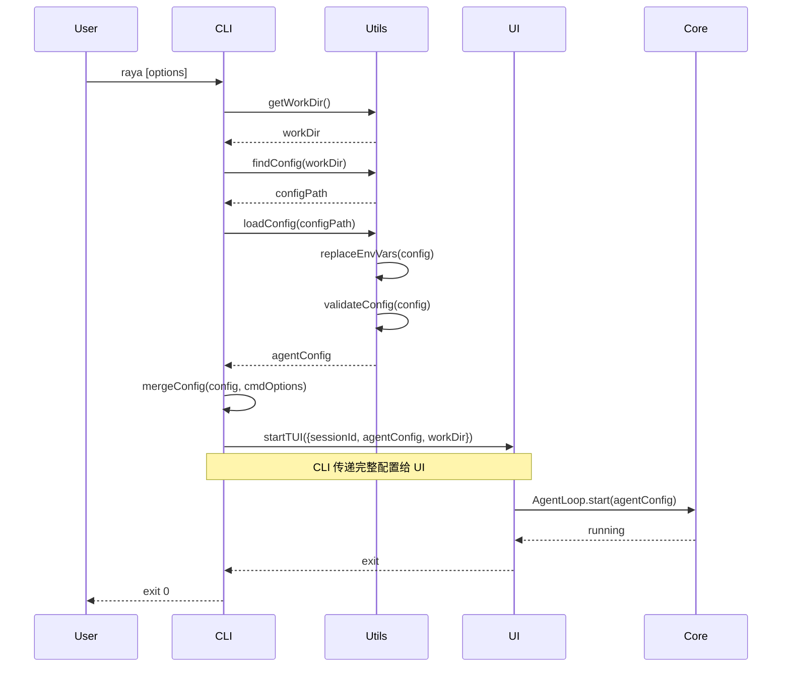
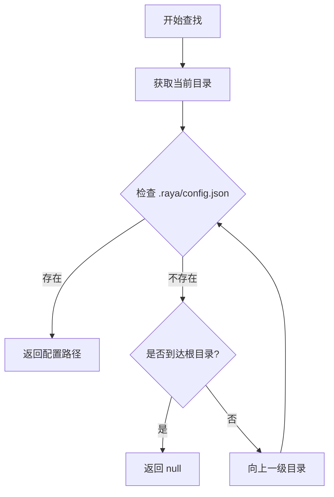
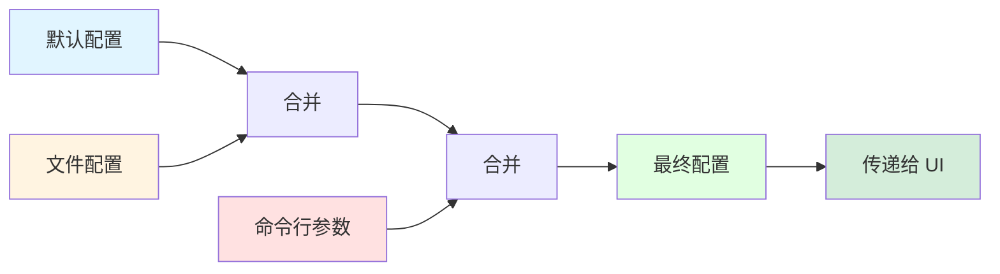

# Raya CLI 工具详细设计文档 v2

## 概述

Raya CLI 是一个全局命令行工具，允许用户在任何目录通过 `raya` 命令启动 Raya AI Agent。该工具负责命令行参数解析、配置文件管理、环境变量处理，并调用 UI 包的 `startTUI()` 函数启动界面。

### 设计目标

1. **简单易用**：用户可以在任何目录执行 `raya` 命令即可启动 Agent
2. **灵活配置**：支持配置文件、环境变量和命令行参数的多层次配置
3. **安全可靠**：保护敏感信息，提供完善的错误处理
4. **跨平台兼容**：在 Windows、Linux 和 macOS 上都能正常工作
5. **职责清晰**：CLI 专注于配置管理，UI 负责界面，Core 负责逻辑

### 核心特性

- 全局命令入口，支持在任何目录启动
- 自动向上查找配置文件
- 环境变量替换和验证
- 交互式配置初始化
- 配置管理和验证
- 会话管理
- 跨平台兼容

## 架构设计

### 系统架构图

```mermaid
graph TB
    User[用户] --> CLI[CLI Package]
    CLI --> UI[UI Package]
    UI --> Core[Core Package]
    Core --> Common[Common Package]
    
    subgraph "CLI Package (packges/cli)"
        Entry[index.ts<br/>命令注册<br/>全局错误处理]
        Commands[commands/<br/>start.ts, init.ts, config.ts]
        Utils[utils/<br/>配置加载、环境变量、验证]
        Templates[templates/<br/>配置模板]
        Types[types/<br/>类型定义]
    end
    
    subgraph "UI Package (packges/ui)"
        TUI[startTUI()<br/>接受 agentConfig 和 workDir]
        AppComponent[App 组件<br/>TUI 界面渲染]
    end
    
    subgraph "Core Package (packges/core)"
        AgentLoop[AgentLoop<br/>Agent 核心逻辑]
        Tools[Tools<br/>工具调用]
        AgentTypes[AgentConfig 类型定义]
    end
    
    subgraph "Common Package (packges/common)"
        SharedUtils[共享工具函数<br/>日志、格式化等]
    end
    
    Entry --> Commands
    Commands --> Utils
    Commands --> Templates
    Commands --> UI
    TUI --> AppComponent
    AppComponent --> AgentLoop
    AgentLoop --> Tools
    Utils --> Common
```

### 包职责划分

#### CLI Package (packges/cli)

**职责**：
- ✅ 命令行参数解析（Commander.js）
- ✅ 配置文件查找和加载（`.raya/config.json`），也支持一些核心配置使用项目中的.env文件进行读取
- ✅ 环境变量替换和验证
- ✅ 交互式配置初始化（`raya init`）
- ✅ 配置管理命令（`raya config`）
- ✅ 调用 UI 包的 `startTUI()` 启动界面

**依赖**：
- `ui`: 导入 `startTUI()` 和 `AgentConfig` 类型
- `core`: 导入 `AgentConfig` 类型（通过 UI 包）
- `common`: 使用共享工具函数（可选）
- `commander`, `inquirer`, `chalk`, `ora`: CLI 工具库

**不负责**：
- ❌ TUI 界面渲染（UI 包负责）
- ❌ Agent 核心逻辑（Core 包负责）
- ❌ 工具调用（Core 包负责）

**关键接口**：
```typescript
// CLI 加载配置并传递给 UI
const config = await loadConfig(workDir);
await startTUI({
  sessionId,
  agentConfig: config,  // CLI 负责加载
  workDir,              // CLI 负责提供
});
```

#### UI Package (packges/ui)

**职责**：
- ✅ 提供 `startTUI()` 函数，接受配置参数
- ✅ TUI 界面渲染（Ink + React）
- ✅ 用户交互处理
- ✅ 调用 Core 包的 AgentLoop

**依赖**：
- `core`: 使用 AgentLoop 和 AgentConfig 类型
- `ink`, `react`: TUI 框架

**接口**：
```typescript
export function startTUI(options?: {
  sessionId?: string;
  agentConfig?: AgentConfig;  // 从 CLI 传入
  workDir?: string;            // 工作目录
}): Promise<void>
```

**向后兼容**：
- 如果不提供 `agentConfig`，从 Core 加载默认配置
- 这样可以保持现有代码的兼容性

#### Core Package (packges/core)

**职责**：
- ✅ Agent 核心逻辑（AgentLoop）
- ✅ 工具注册和调用
- ✅ 提供 AgentConfig 类型定义
- ✅ 提供默认配置加载（向后兼容）

**依赖**：
- `common`: 共享工具函数
- `ai`: AI SDK

**导出**：
```typescript
export type { AgentConfig } from './agent/type';
export { AgentLoop } from './session/loop';
export { loadAndGetAgent } from './agent/agent';  // 向后兼容
```

#### Common Package (packges/common)

**职责**：
- ✅ 共享工具函数（日志、格式化等）
- ✅ 共享常量和配置

**依赖**：无

### 数据流设计

#### 启动流程（方案 A）



#### 配置查找流程



#### 配置合并流程



## 组件和接口

### 1. 入口模块（index.ts）

#### 职责
- 注册所有 CLI 命令
- 配置命令行参数解析
- 全局错误处理
- 版本信息管理

#### 实现

```typescript
#!/usr/bin/env bun
import { Command } from 'commander';
import { startAgent } from './commands/start';
import { initConfig } from './commands/init';
import { manageConfig } from './commands/config';
import { handleError } from './utils/error';
import pkg from '../package.json';

const program = new Command();

program
  .name('raya')
  .description('Raya AI Agent CLI')
  .version(pkg.version);

// 注册 start 命令（默认）
program
  .command('start', { isDefault: true })
  .description('启动 Raya Agent')
  .option('-c, --config <path>', '配置文件路径')
  .option('-m, --model <model>', '模型名称')
  .option('-v, --verbose', '详细日志')
  .option('-s, --session <id>', '会话 ID')
  .action(startAgent);

// 注册 init 命令
program
  .command('init')
  .description('初始化配置文件')
  .option('-f, --force', '强制覆盖')
  .option('-t, --template <name>', '使用模板 (openai|anthropic|azure|custom)')
  .action(initConfig);

// 注册 config 命令
program
  .command('config')
  .description('管理配置')
  .option('-s, --show', '显示配置')
  .option('-e, --edit', '编辑配置')
  .option('-v, --validate', '验证配置')
  .option('-p, --path', '显示路径')
  .action(manageConfig);

// 全局错误处理
process.on('uncaughtException', (error) => {
  handleError(error, process.env.RAYA_VERBOSE === 'true');
});

process.on('unhandledRejection', (reason) => {
  handleError(new Error(String(reason)), process.env.RAYA_VERBOSE === 'true');
});

program.parse();
```

### 2. 启动命令（commands/start.ts）

#### 职责
- 获取当前工作目录
- 加载和验证配置文件
- 处理命令行参数覆盖
- 调用 UI 包的 `startTUI()` 启动界面

#### 实现

```typescript
import ora from 'ora';
import chalk from 'chalk';
import { startTUI } from 'ui';
import type { AgentConfig } from 'ui';
import { getWorkDir, validateWorkDir } from '../utils/workdir';
import { loadConfig, mergeConfig } from '../utils/config';
import { generateSessionId, validateSessionId } from '../utils/session';
import { displayWelcome } from '../utils/display';
import { handleError } from '../utils/error';

export interface StartOptions {
  config?: string;      // 配置文件路径
  model?: string;       // 模型名称
  verbose?: boolean;    // 详细日志
  session?: string;     // 会话 ID
}

export async function startAgent(options: StartOptions): Promise<void> {
  const spinner = ora('正在启动 Raya Agent...').start();
  
  try {
    // 1. 获取工作目录
    const workDir = getWorkDir();
    if (!validateWorkDir(workDir)) {
      throw new Error(`工作目录无效: ${workDir}`);
    }
    
    // 2. 加载配置
    spinner.text = '正在加载配置...';
    const config = await loadConfig(workDir, {
      configPath: options.config,
      validate: true,
    });
    
    // 3. 命令行参数覆盖
    const finalConfig: AgentConfig = mergeConfig(config, {
      model: options.model,
    } as Partial<AgentConfig>);
    
    // 4. 生成或验证会话 ID
    let sessionId = options.session || generateSessionId();
    if (!validateSessionId(sessionId)) {
      spinner.warn('会话 ID 格式无效，使用默认 ID');
      sessionId = generateSessionId();
    }
    
    spinner.succeed('配置加载成功');
    
    // 5. 显示欢迎信息
    displayWelcome(workDir, finalConfig);
    
    // 6. 启动 TUI（传递配置）
    await startTUI({
      sessionId,
      agentConfig: finalConfig,  // CLI 负责加载和传递配置
      workDir,
    });
    
  } catch (error) {
    spinner.fail('启动失败');
    handleError(error as Error, options.verbose);
    process.exit(1);
  }
}
```

### 3. 配置加载工具（utils/config.ts）

#### 职责
- 向上递归查找配置文件
- 读取和解析 JSON 配置
- 环境变量替换
- 配置合并

#### 实现

```typescript
import fs from 'fs/promises';
import path from 'path';
import type { AgentConfig } from 'ui';
import { replaceEnvVars } from './env';
import { validateConfig } from './validate';
import { ConfigError } from '../types/error';

export interface LoadOptions {
  configPath?: string;  // 自定义配置路径
  validate?: boolean;   // 是否验证配置
}

/**
 * 加载配置文件
 * 
 * @param workDir - 工作目录
 * @param options - 加载选项
 * @returns Agent 配置对象
 */
export async function loadConfig(
  workDir: string,
  options: LoadOptions = {}
): Promise<AgentConfig> {
  // 1. 查找配置文件
  let configPath: string | null;
  
  if (options.configPath) {
    // 使用指定路径
    configPath = path.resolve(options.configPath);
  } else {
    // 向上查找
    configPath = await findConfig(workDir);
  }
  
  if (!configPath) {
    throw new ConfigError(
      'CONFIG_NOT_FOUND',
      '配置文件未找到，请运行: raya init'
    );
  }
  
  // 2. 读取文件
  const content = await fs.readFile(configPath, 'utf-8');
  
  // 3. 解析 JSON
  let config: any;
  try {
    config = JSON.parse(content);
  } catch (error) {
    throw new ConfigError(
      'CONFIG_PARSE_ERROR',
      `配置文件解析失败: ${(error as Error).message}`
    );
  }
  
  // 4. 替换环境变量
  const replaced = replaceEnvVars(config);
  
  // 5. 验证配置
  if (options.validate !== false) {
    const validation = validateConfig(replaced);
    if (!validation.valid) {
      throw new ConfigError(
        'CONFIG_INVALID',
        `配置验证失败:\n${validation.errors.map(e => `  - ${e}`).join('\n')}`
      );
    }
  }
  
  return replaced as AgentConfig;
}

/**
 * 向上递归查找配置文件
 * 
 * @param startDir - 起始目录
 * @returns 配置文件路径或 null
 */
export async function findConfig(startDir: string): Promise<string | null> {
  let currentDir = path.resolve(startDir);
  
  while (true) {
    const configPath = path.join(currentDir, '.raya', 'config.json');
    
    try {
      await fs.access(configPath);
      return configPath;
    } catch {
      // 文件不存在，继续向上查找
    }
    
    const parentDir = path.dirname(currentDir);
    
    // 到达根目录
    if (parentDir === currentDir) {
      return null;
    }
    
    currentDir = parentDir;
  }
}

/**
 * 合并配置对象（深度合并）
 * 
 * @param base - 基础配置
 * @param override - 覆盖配置
 * @returns 合并后的配置
 */
export function mergeConfig(
  base: Partial<AgentConfig>,
  override: Partial<AgentConfig>
): AgentConfig {
  // 简单的深度合并实现
  const result = { ...base };
  
  for (const [key, value] of Object.entries(override)) {
    if (value === undefined) continue;
    
    if (typeof value === 'object' && !Array.isArray(value) && value !== null) {
      // 递归合并对象
      result[key as keyof AgentConfig] = {
        ...(result[key as keyof AgentConfig] as any),
        ...value,
      } as any;
    } else {
      // 直接覆盖
      result[key as keyof AgentConfig] = value as any;
    }
  }
  
  return result as AgentConfig;
}
```

### 4. 环境变量处理（utils/env.ts）

#### 实现

```typescript
/**
 * 递归替换对象中的环境变量占位符
 * 
 * @param obj - 任意对象
 * @returns 替换后的对象
 */
export function replaceEnvVars(obj: any): any {
  // 字符串：替换占位符
  if (typeof obj === 'string') {
    return obj.replace(/\$\{([^}]+)\}/g, (match, varName) => {
      return process.env[varName] || '';
    });
  }
  
  // 数组：递归处理每个元素
  if (Array.isArray(obj)) {
    return obj.map(item => replaceEnvVars(item));
  }
  
  // 对象：递归处理每个属性
  if (obj && typeof obj === 'object') {
    const result: any = {};
    for (const [key, value] of Object.entries(obj)) {
      result[key] = replaceEnvVars(value);
    }
    return result;
  }
  
  // 其他类型：直接返回
  return obj;
}

/**
 * 验证必需的环境变量
 * 
 * @param config - Agent 配置
 * @returns 缺失的环境变量列表
 */
export function validateEnvVars(config: any): string[] {
  const missing: string[] = [];
  
  // 检查必需的环境变量
  if (!config.api_key || config.api_key.trim() === '') {
    missing.push('api_key');
  }
  
  if (!config.base_url || config.base_url.trim() === '') {
    missing.push('base_url');
  }
  
  return missing;
}

/**
 * 获取环境变量设置提示
 * 
 * @param provider - 提供商名称
 * @returns 提示信息列表
 */
export function getEnvVarHints(provider: string): string[] {
  const hints: Record<string, string[]> = {
    openai: [
      'export OPENAI_API_KEY="sk-..."',
      '或在配置文件中设置: "api_key": "${OPENAI_API_KEY}"',
    ],
    anthropic: [
      'export ANTHROPIC_API_KEY="sk-ant-..."',
      '或在配置文件中设置: "api_key": "${ANTHROPIC_API_KEY}"',
    ],
    azure: [
      'export AZURE_OPENAI_ENDPOINT="https://..."',
      'export AZURE_OPENAI_API_KEY="..."',
    ],
  };
  
  return hints[provider] || [];
}
```

## 配置模板

### OpenAI 模板

```typescript
// src/templates/openai.ts
import type { AgentConfig } from 'ui';

export const openaiTemplate: Partial<AgentConfig> = {
  name: 'openai-agent',
  version: '1.0.0',
  description: 'OpenAI GPT Agent',
  base_url: 'https://api.openai.com/v1',
  api_key: '${OPENAI_API_KEY}',
  model: 'gpt-4',
  model_id: 'gpt-4',
  provider: 'openai',
  tools: [],
  max_retries: 3,
  timeout: 30000,
  prompt: 'You are a helpful AI assistant.',
};
```

### Anthropic 模板

```typescript
// src/templates/anthropic.ts
import type { AgentConfig } from 'ui';

export const anthropicTemplate: Partial<AgentConfig> = {
  name: 'claude-agent',
  version: '1.0.0',
  description: 'Anthropic Claude Agent',
  base_url: 'https://api.anthropic.com',
  api_key: '${ANTHROPIC_API_KEY}',
  model: 'claude-3-5-sonnet-20241022',
  model_id: 'claude-3-5-sonnet-20241022',
  provider: 'anthropic',
  tools: [],
  max_retries: 3,
  timeout: 30000,
  prompt: 'You are Claude, a helpful AI assistant.',
};
```

### Azure 模板

```typescript
// src/templates/azure.ts
import type { AgentConfig} from 'ui';

export const azureTemplate: Partial<AgentConfig> = {
  name: 'azure-agent',
  version: '1.0.0',
  description: 'Azure OpenAI Agent',
  base_url: '${AZURE_OPENAI_ENDPOINT}',
  api_key: '${AZURE_OPENAI_API_KEY}',
  model: 'gpt-4',
  model_id: 'gpt-4',
  provider: 'azure',
  tools: [],
  max_retries: 3,
  timeout: 30000,
  prompt: 'You are a helpful AI assistant.',
};
```

### 模板导出

```typescript
// src/templates/index.ts
import { openaiTemplate } from './openai';
import { anthropicTemplate } from './anthropic';
import { azureTemplate } from './azure';
import type { AgentConfig } from 'ui';

export { openaiTemplate, anthropicTemplate, azureTemplate };

export const templates: Record<string, Partial<AgentConfig>> = {
  openai: openaiTemplate,
  anthropic: anthropicTemplate,
  azure: azureTemplate,
};

export function getTemplate(name: string): Partial<AgentConfig> {
  const template = templates[name];
  if (!template) {
    throw new Error(`未知的模板: ${name}`);
  }
  return { ...template };
}
```

## 关键变更总结

### 与原设计的主要区别

1. **配置加载职责**：
   - ❌ 原设计：Core 包内部加载配置
   - ✅ 新设计：CLI 包加载配置并传递给 UI

2. **startTUI 接口**：
   - ❌ 原设计：`startTUI({ sessionId })`
   - ✅ 新设计：`startTUI({ sessionId, agentConfig, workDir })`

3. **包依赖关系**：
   - ❌ 原设计：CLI → UI（UI 内部调用 Core 加载配置）
   - ✅ 新设计：CLI → UI（CLI 传递配置给 UI）

4. **职责划分**：
   - ✅ CLI：配置文件管理、环境变量处理、命令行交互
   - ✅ UI：界面渲染、用户交互
   - ✅ Core：Agent 逻辑、工具调用

### 优势

1. **职责清晰**：每个包有明确的职责边界
2. **灵活性高**：配置可以来自任何来源（文件、环境变量、命令行）
3. **易于测试**：可以独立测试配置加载逻辑
4. **向后兼容**：UI 包保持向后兼容，不提供配置时使用默认配置

## 目录结构

```
packges/cli/
├── src/
│   ├── index.ts                 # 入口文件（命令注册）
│   ├── commands/                # 命令实现
│   │   ├── start.ts             # 启动命令（调用 startTUI）
│   │   ├── init.ts              # 初始化命令
│   │   └── config.ts            # 配置管理命令
│   ├── utils/                   # 工具函数
│   │   ├── config.ts            # 配置加载和查找
│   │   ├── workdir.ts           # 工作目录管理
│   │   ├── env.ts               # 环境变量处理
│   │   ├── logger.ts            # 日志工具
│   │   ├── validate.ts          # 配置验证
│   │   ├── editor.ts            # 编辑器集成
│   │   ├── session.ts           # 会话管理
│   │   ├── display.ts           # 显示工具
│   │   └── error.ts             # 错误处理
│   ├── templates/               # 配置模板
│   │   ├── index.ts             # 模板导出
│   │   ├── openai.ts            # OpenAI 模板
│   │   ├── anthropic.ts         # Anthropic 模板
│   │   └── azure.ts             # Azure 模板
│   ├── types/                   # 类型定义
│   │   ├── index.ts             # 类型导出
│   │   ├── config.ts            # 配置类型
│   │   └── error.ts             # 错误类型
│   └── example.ts               # 使用示例
├── test/                        # 测试文件
│   ├── unit/                    # 单元测试
│   ├── property/                # 属性测试
│   ├── integration/             # 集成测试
│   └── e2e/                     # 端到端测试
├── docs/                        # 文档
├── dist/                        # 构建输出
├── package.json                 # 包配置
├── tsconfig.json                # TypeScript 配置
├── .gitignore                   # Git 忽略
└── README.md                    # 项目说明
```

## 实现优先级

### P0（必须）- 核心功能
1. ✅ 项目初始化和基础配置
2. 类型定义（config.ts, error.ts）
3. 工具函数（config.ts, env.ts, workdir.ts, validate.ts）
4. 启动命令（start.ts）
5. 入口文件（index.ts）

### P1（重要）- 扩展功能
6. 配置模板（openai.ts, anthropic.ts, azure.ts）
7. 初始化命令（init.ts）
8. 配置管理命令（config.ts）
9. 会话管理（session.ts）
10. 编辑器工具（editor.ts）

### P2（可选）- 测试和文档
11. 单元测试
12. 属性测试
13. 集成测试
14. E2E 测试
15. 文档完善
